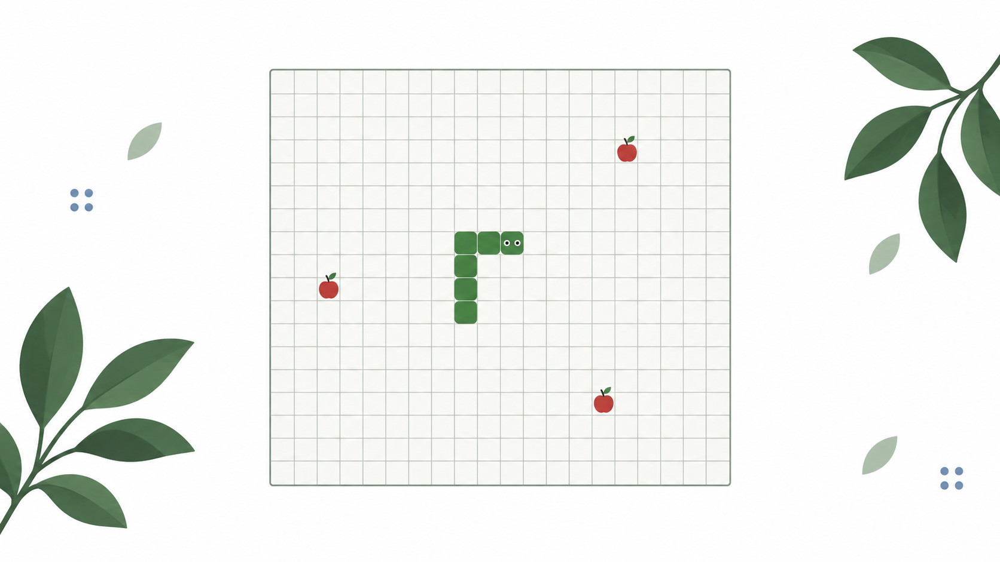

# Snake

A clean, quick-to-play Snake game for desktop and mobile. Choose a mode, set the pace, and play instantly in the browser.

## Play

Open `index.html` in a modern browser. No installation, account, or server is required.

## Game modes

| Mode | Rules |
| --- | --- |
| Classic | Grow by eating food. Avoid walls and your tail. |
| Wrap | Cross an edge to reappear on the opposite side. Avoid your tail. |
| Maze | Navigate barriers as well as walls and your tail. |
| Time Attack | Score as much as possible in 60 seconds of active play. |
| Zen | Play without collisions or a timer. |

Use the speed slider to choose 3–18 moves per second, or tap a preset. You can also change the board size, place 1, 3, or 5 food items at once, and enable gradual speed-up.

## Controls

| Action | Control |
| --- | --- |
| Move | Arrow keys or WASD |
| Pause / resume | Space or P |
| Restart | R |
| Touch | Swipe on the board or use the direction buttons |

The game tracks food eaten in the current run and across all runs. High scores are saved per mode and board size on your device, along with your longest snake and preferences. It also pauses when the tab loses focus.

## Features

- Light, dark, and blue themes
- Sound, grid, and food-effect controls
- Responsive layout and touch controls
- No dependencies, trackers, or account required

Made with HTML, CSS, and JavaScript. The game runs entirely in your browser; saved progress uses local storage.

Build with ❤️ by Anjan Shetty
